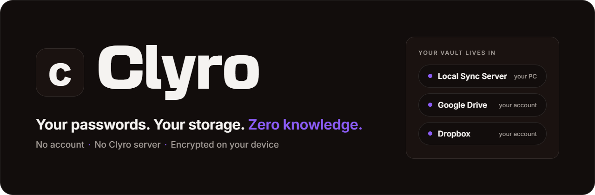
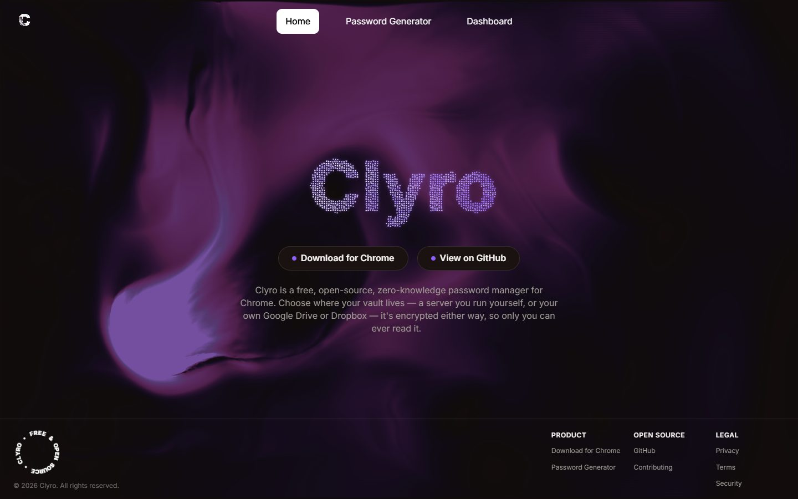
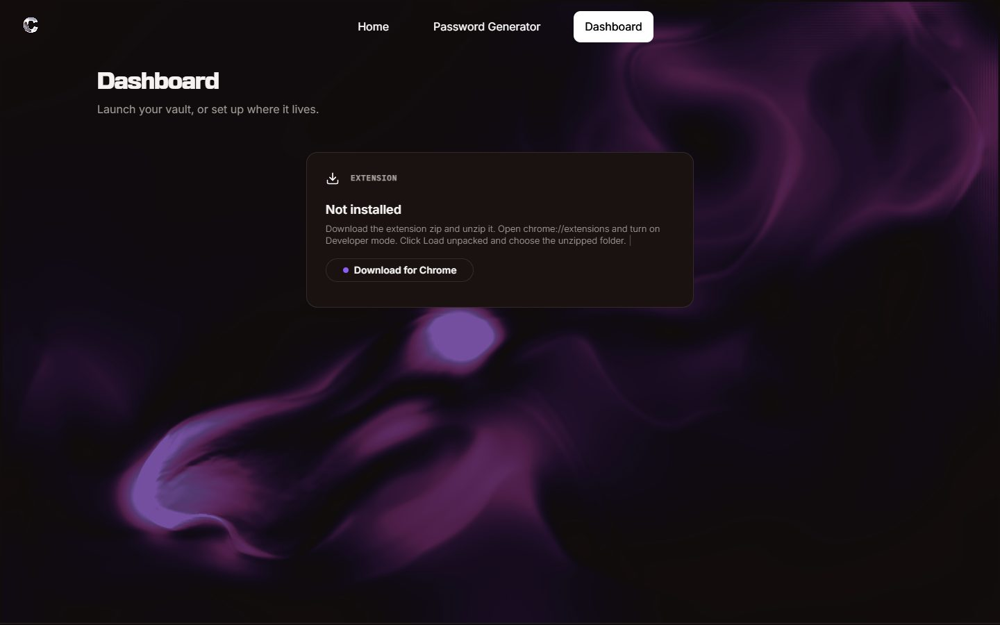
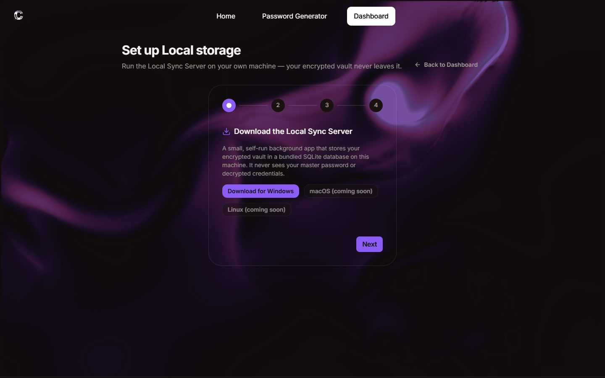
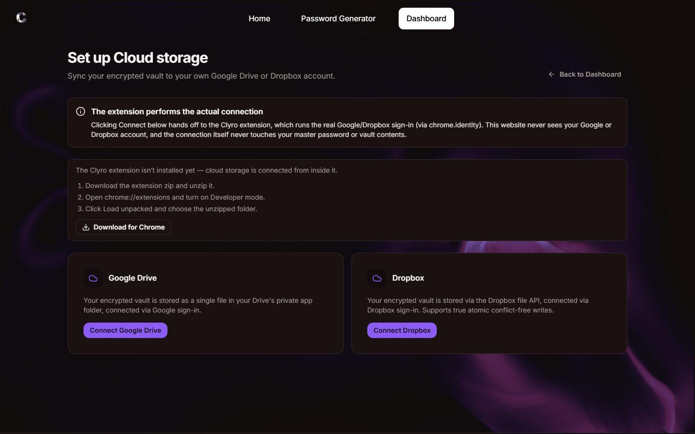
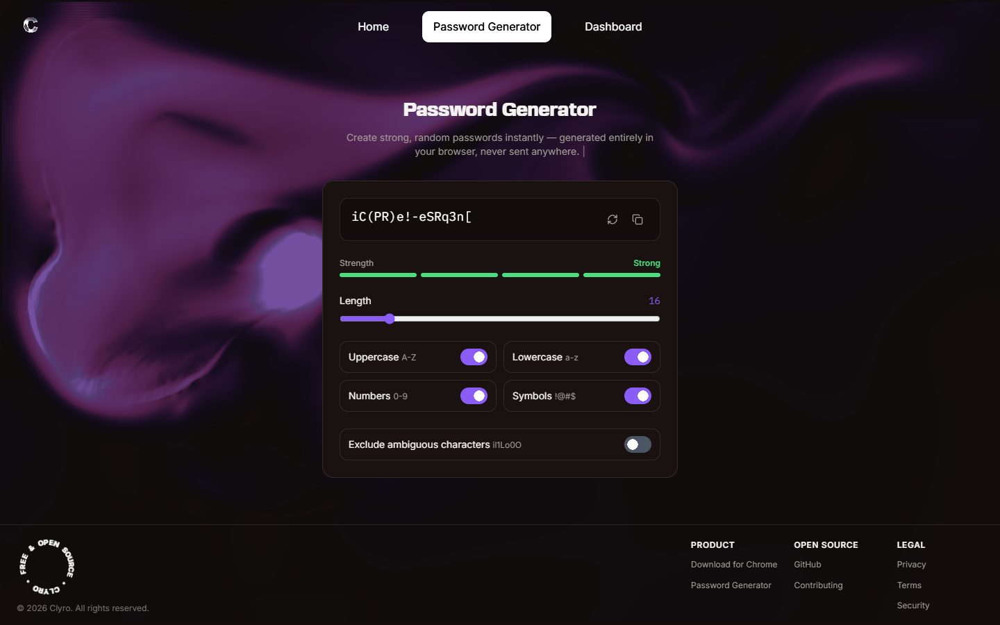
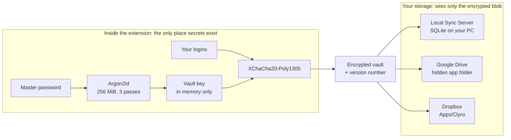
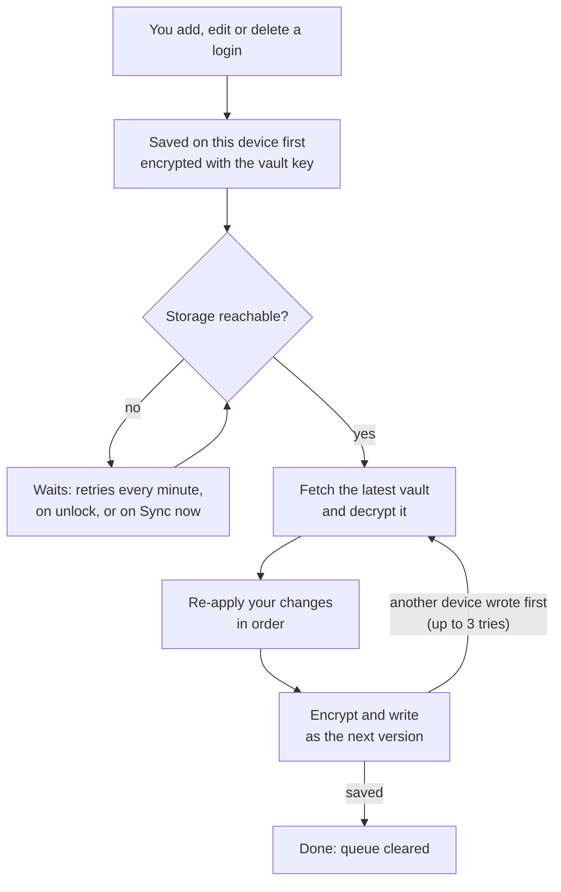
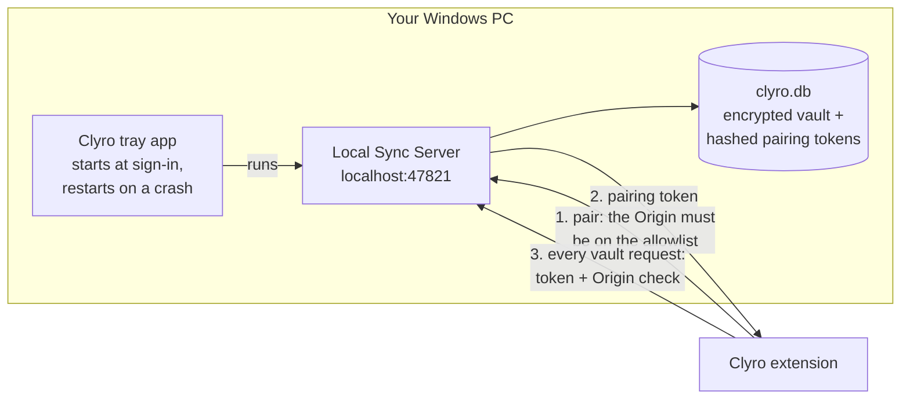

<p align="center">
  
</p>

<p align="center">
  <a href="https://clyrovault.pages.dev"></a>
  <a href="https://github.com/ClyroVaultSync/clyro/releases/tag/v1.0.0"></a>
  <a href="LICENSE"></a>
  
  
  
  
  
</p>

<p align="center">
  <a href="https://clyrovault.pages.dev"><b>Website</b></a> ·
  <a href="https://github.com/ClyroVaultSync/clyro/releases/tag/v1.0.0"><b>Download</b></a> ·
  <a href="#-get-started-in-3-steps">Get started</a> ·
  <a href="#-how-it-works">How it works</a> ·
  <a href="#-security-model">Security</a> ·
  <a href="#-run-it-developers">Run it</a>
</p>

<p align="center"><sub>🌐 Live at <a href="https://clyrovault.pages.dev"><b>clyrovault.pages.dev</b></a> · ⬇ <a href="https://github.com/ClyroVaultSync/clyro/releases/tag/v1.0.0"><b>v1.0.0</b></a>: the Chrome extension and the Windows Local Sync Server.</sub></p>

---

Most password managers keep your vault on their servers. **Clyro doesn't have any.**

Your vault is encrypted inside your browser, then stored where *you* choose: a small server on your own PC, your Google Drive, or your Dropbox.

No account to create. Nothing anyone else can read, us included.

<p align="center">
  
  <br /><sub>The homepage at clyrovault.pages.dev. Get the extension, pick where your vault lives, set a master password. That's it.</sub>
</p>

## Contents

[At a glance](#-at-a-glance) · [What Clyro does](#-what-clyro-does) · [Get started](#-get-started-in-3-steps) · [Screenshots](#-screenshots) · [How it works](#-how-it-works) · [Security model](#-security-model) · [Storage providers](#-storage-providers) · [Engineering](#-engineering) · [Run it](#-run-it-developers) · [Roadmap](#-roadmap) · [Contributing](#-contributing) · [Credits](#-credits)

## ◉ At a glance

| | |
|---|---|
| **Encryption** | **Argon2id** (256 MiB, 3 passes) turns your master password into a key; **XChaCha20-Poly1305** seals the vault. Both run inside the extension |
| **Storage** | Your pick: the **Local Sync Server** on your PC, your **Google Drive**, or your **Dropbox** |
| **Account** | **None.** No sign-up, no email, no Clyro server holding anything of yours |
| **Offline** | Saves land on your device first, encrypted, and sync when your storage answers again |
| **Platforms** | Chrome (Manifest V3) · Local Sync Server for Windows · macOS and Linux server on the way |
| **Status** | **v1.0.0**, the first public release. Free and open source (MIT) |

## ✦ What Clyro does

Three things. Everything in this repo serves one of them.

### 1. Encrypt on your device

Your master password never leaves the extension. Argon2id stretches it into a key that lives only in memory, and XChaCha20-Poly1305 seals the vault before anything is stored or sent.

### 2. Store it where you choose

Pick one storage provider at setup: a small server on your own PC, your Google Drive, or your Dropbox. Each one only ever holds an encrypted blob. Move between them any time with an encrypted export.

### 3. Fill and save as you browse

The extension fills logins, offers to save new or changed passwords, and keeps your whole vault one click away in a full-page view. The website is only a launcher: it never sees what's inside.

## ▶ Get started in 3 steps

1. **Add the extension.** Download [`Clyro-Extension-1.0.0.zip`](https://github.com/ClyroVaultSync/clyro/releases/download/v1.0.0/Clyro-Extension-1.0.0.zip) and unzip it. Open `chrome://extensions`, turn on **Developer mode**, click **Load unpacked** and choose the unzipped folder.
2. **Install the Local Sync Server** (Windows). Run [`ClyroLocalSyncServer-Setup-1.0.0.exe`](https://github.com/ClyroVaultSync/clyro/releases/download/v1.0.0/ClyroLocalSyncServer-Setup-1.0.0.exe). It starts right away and at every sign-in; look for the Clyro icon near the clock.
3. **Create your vault.** Open the extension, choose **Local Sync Server**, click **Connect**, and set a master password. There's no reset, so keep it somewhere safe.

> [!TIP]
> The installer isn't code-signed yet. If Chrome says the file "isn't commonly downloaded", choose **Keep**. If Windows says "Windows protected your PC", choose **More info → Run anyway**.

> [!NOTE]
> **Local storage works for everyone today.** Google Drive and Dropbox are limited to invited testers for now: the Google app is still in Google's testing mode, and the Dropbox app is still in development.

## 🖼 Screenshots

<table>
  <tr>
    <td width="50%"><br /><sub><b>Dashboard.</b> It reads the extension's status and walks you through installing it.</sub></td>
    <td width="50%"><br /><sub><b>Local setup.</b> Four steps: download, install, pair, back up.</sub></td>
  </tr>
  <tr>
    <td width="50%"><br /><sub><b>Cloud setup.</b> Google Drive or Dropbox, connected from inside the extension.</sub></td>
    <td width="50%"><br /><sub><b>Password generator.</b> Runs entirely in your browser; nothing is sent anywhere.</sub></td>
  </tr>
</table>

## ⚙ How it works

**Your secrets stay in the extension.** Storage only ever gets the sealed result.



**The life of a save.** Nothing is lost when you're offline, and nothing is overwritten when two devices save at once.



**The Windows app.** A tray icon keeps the server running. It listens on your PC only, and every vault request needs the pairing token.



## 🔒 Security model

**Never leaves the extension:** your master password, the vault key, and your logins in plain text.

| | Where it lives | Who can read it |
|---|---|---|
| **Master password** | Typed into the extension. Never stored anywhere | You |
| **Vault key** | Extension memory only (`chrome.storage.session`). Gone when you lock or close the browser | The extension, while unlocked |
| **Encrypted vault** | Your chosen storage, plus an encrypted cache in the extension | Nobody without your master password |
| **Pairing token** (Local) | The extension; your server keeps only its SHA-256 hash | Your extension and your server |

**What everyone else can see:**

| | Can see | Never sees |
|---|---|---|
| **Local Sync Server** | An encrypted blob, a version number, the vault's salt | Your master password, key or logins |
| **Google Drive / Dropbox** | One encrypted file in Clyro's own app folder | Your master password, key or logins |
| **This website** | Whether the extension is installed, which storage it uses, locked or not | Anything in your vault |
| **Clyro (us)** | Nothing. There's no Clyro server to send anything to | Everything |

> [!IMPORTANT]
> **There is no recovery.** Zero knowledge means nobody can reset your master password. Keep an encrypted export (extension → Settings → Export) somewhere safe; it's also how you move between storage providers.

## 🗄 Storage providers

| | Local Sync Server | Google Drive | Dropbox |
|---|---|---|---|
| **Where your vault lives** | `%LOCALAPPDATA%\Clyro\clyro.db` on your PC | A hidden app-only folder in your Drive | `Apps/Clyro/` in your Dropbox |
| **How it signs in** | A pairing token from your own server | Google sign-in, `drive.appdata` scope only | Dropbox sign-in (OAuth with PKCE) |
| **Two devices saving at once** | Atomic version check: a stale write is refused | Version re-read right before each write | Atomic `rev` compare-and-swap, plus the version check |
| **You need** | A Windows PC | A Google account | A Dropbox account |
| **Available to** | Everyone | Invited testers, for now | Invited testers, for now |

## 🛠 Engineering

- **168 tests** on `pnpm -r test`: 139 for the extension, 22 for the Local Sync Server, 7 for the crypto package.
- **A bridge that can't leak.** The website talks to the extension through `chrome.runtime` messages whose types (`packages/shared-types`) have no field that could carry a password, key or vault. Status only, enforced by the compiler.
- **Saves carry the change, not the list**, so a save can be safely re-applied on top of whatever another device just wrote.
- **A pnpm monorepo** of three apps and two shared packages, all TypeScript.
- **A static website.** A Next.js static export on Cloudflare Pages, with no server of its own.
- **One-file server.** The Local Sync Server is packed into a single Windows executable with Node's single-executable-app feature, alongside a small C# tray app and an Inno Setup installer.

<details>
<summary><b>Stack</b></summary>

TypeScript · React 18 · Vite + CRXJS (Manifest V3) · Next.js 14 (static export) · Tailwind CSS 4 · Fastify 4 · `node:sqlite` · libsodium (Argon2id, XChaCha20-Poly1305) · Vitest · pnpm workspaces · Cloudflare Pages · Inno Setup

</details>

## ▶ Run it (developers)

You need **Node 22.13+** (for `node:sqlite`) and **pnpm 11**.

```bash
pnpm install
pnpm dev        # extension (Vite, :5173), website (:3000) and Local Sync Server (:47821), together
pnpm -r test    # every test in the monorepo
```

While `pnpm dev` runs, load `apps/extension/dist` in `chrome://extensions` (**Developer mode → Load unpacked**). It reloads as you edit.

**Windows installer:** `pnpm --filter @clyro/backend package:win` writes `apps/backend/release/ClyroLocalSyncServer-Setup-<version>.exe`. It needs [Inno Setup 6](https://jrsoftware.org/isinfo.php); the tray app is compiled with the `csc.exe` that ships with Windows.

> [!NOTE]
> The dev server and the installed app both use port **47821**. Quit the installed app from its tray icon first, or start the dev server with a different `PORT`.

<details>
<summary><b>Repository layout</b></summary>

```
apps/extension/          Chrome extension (MV3): vault UI, crypto, autofill, storage providers, offline queue
apps/website/            Next.js site: homepage, password generator, dashboard, setup guides, legal pages
apps/backend/            Local Sync Server (Fastify + SQLite), plus the Windows tray app and installer
packages/crypto/         Argon2id key derivation and XChaCha20-Poly1305 vault encryption
packages/shared-types/   The SyncProvider interface and the website ↔ extension bridge types
packages/config/         Shared lint and TypeScript presets
docs/                    Product, architecture, security, API and database specs
```

The specs start at [docs/README.md](docs/README.md).

</details>

## 🧭 Roadmap

- **Chrome Web Store listing**: one-click install instead of Load unpacked.
- **Code signing**: no more SmartScreen or download warnings.
- **Google Drive and Dropbox for everyone**: out of testing, open to all.
- **macOS and Linux**: the Local Sync Server beyond Windows.

## 🤝 Contributing

Contributions are welcome, from a one-line bug report to a pull request.

- **Found a bug or have an idea?** [Open an issue](https://github.com/ClyroVaultSync/clyro/issues).
- **Found a security problem?** Please don't post it publicly. [Report it privately](https://github.com/ClyroVaultSync/clyro/security/advisories/new) instead.
- **Want to write code?** Read [CONTRIBUTING.md](docs/CONTRIBUTING.md) first. It covers setup, the zero-knowledge rules every change must keep, and what a good pull request includes.

## 👤 Credits

Built by **Shreyas R Angadi** ([@Zopyrus269](https://github.com/Zopyrus269)) · **ClyroVaultSync**

## 📄 License

[MIT](LICENSE) © 2026 ClyroVaultSync

<p align="center"><sub>Your passwords. Your storage. Zero knowledge.</sub></p>
